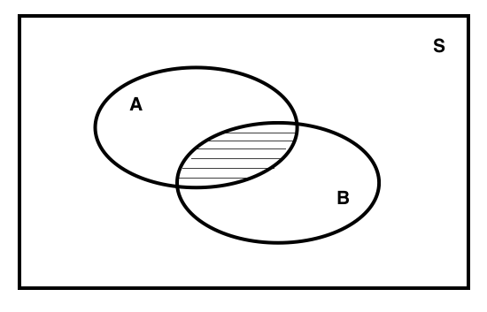

# Conditional Probability and Bayes' Rule {#cond}

Let's recall some probability concepts.

+ Probability is the quantification of uncertainty. For instance in a coin toss, $P(H) = 1/2$.
+ Set of the union of all possible events is the sample space. For instance single coin toss sample space is $S = \{H,T\}$.
+ Probability of an event is actually the relative "size" of the event to the sample space.
+ In an experiment, that has equally likely outcomes, number of potential outcomes in an event relative to the total number of outcomes in the sample space corresponds to the probability of that event.
+ Some events are mutually exclusive and some events are dependent.
+ Sample space is not always easy to measure and is not always finite. Counting is one way of estimating a sample space (especially discrete ones).
+ Estimation of probability of events is not always easy. One way to estimate is to repeat the experiment for a number of times. As we increase the number of repetitions, the probability will become more stable. For instance suppose we don't know the probability of getting (H)eads in a coin toss and we repeat coin tossing for a number of times.

```{r}
set.seed(231)
coin_toss_probability<-function(repetitions){
    experiment<-sample(c("H","T"),size=repetitions,replace=TRUE)
    return(round(sum(experiment=="H")/repetitions,4))
}
#Do the experiment with increasing repetitions
coin_toss_probability(repetitions=10)
coin_toss_probability(repetitions=100)
coin_toss_probability(repetitions=1000)
coin_toss_probability(repetitions=50000)
```

## Some Examples

1. In a sports bar, there are 10 football fans, 15 basketball fans, 12 tennis fans and 6 curling fans. Suppose there is a single TV and there are matches of football, basketball, tennis and curling at the same time. If the TV remote is handed to one of them randomly, what is the probability that curling will be the show on TV?

    Answer: There are a total of 43 fans in the sports bar and 6 curling fans. P(Curling) = 6/43.

2. Suppose there is a group of 20 people; 10 from Ankara, 10 from Istanbul. Suppose we randomly choose 5 people from that group.

    a. What is the probability that all of this subgroup is from Ankara?

        Answer: (# of combinations including people only from Ankara) / (# of total combinations)

        $$\dfrac{\binom{10}{5}}{\binom{20}{5}} = 0.01625387$$

        Alternative answer is: $(10/20)*(9/19)\dots * (6/16) = 0.01625387$.

    b. What is the probability that at least two from Ankara and at least two from Istanbul?

        Answer: P(Ankara = 2, Istanbul = 3 OR Ankara = 3, Istanbul = 2) = (P(Ankara = 2, Istanbul = 3) + P(Ankara = 3, Istanbul = 2)) = ((# of comb. Ank 2, Ist 3) + (# of comb. Ank 3, Ist 2))/(# of total combinations)

        $$\dfrac{\binom{10}{2}*\binom{10}{3} + \binom{10}{3}*\binom{10}{2}}{\binom{20}{5}} = 0.6965944$$

3. ("Blackjack") Suppose you are drawing two cards from the deck. Assume all number rank cards (2-10) are points, Ace (A) is 11 points and (J)ack, (Q)ueen and (K)ing are 10 points. What is the probability that total points of these two cards exceed 20.

    Answer: Max score for two cards is 22 (two Aces). To exceed 20, one needs Ace-9 pairs or any pair of 10-Ace-J-Q-K cards. We know that there are 4 of each rank. So $P(Score \ge 20) = P(A and 9) + P(any\ two\ of\ 10-Ace-J-Q-K)$. We know that total number of hands is $\binom{52}{2} = 1326$. So # of combinations with either A-9 or 9-A is $4*4 = 16$. # of combinations of getting two cards from 10-Ace-J-Q-K ranks is $\binom{20}{2} = 190$. So $P(Score \ge 20) = \dfrac{190 + 16}{1326} = 0.1553544$

    Alternative answer: $P(A-9 or 9-A) = 4/52*4/51 + 4/52*4/51 = 0.01206637$ and $P(any two of 10-Ace-J-Q-K) = 20/52 * 19/51 = 0.1432881$. Total probability is $P(Score \ge 20) = 0.01206637 + 0.1432881 = 0.1553545$

4. Suppose you are the gatekeeper of a playing ground for 10 year old boys and try to assess their age by their height. Height of 90% of boys aged 10 falls between 130 and 150 cms. It is equally likely that a boy aged 10 has the height lower than 130 cm or higher than 150 cm. What is the probability of rejecting a child because he's too long?

    Answer: $P(130 \le X \le 150) = 0.9$ and $P(X \le 130) = P(X \ge 150)$. So $P(X \ge 150) = 1 - P(130 \le X \le 150) - P(X \le 130)$. $2.P(X \ge 150) = 0.1$ and $P(X \ge 150) = 0.05$.

## Conditional Probability

Definition: $P(A|B)$ means that probability of event A given that event B already occured or probability of A **conditional on** B.



Example: What is the probability of getting two heads (HH) if we know that the first coin is H? (1/2)

Example: Suppose we are rolling two dice.

a. What is the probability of getting the sum equal to 8?

    $P(Sum = 8) = P(D_1 = 2, D_2 = 6) + P({3,5}) + P({4,4})*2 + P({5,3}) + P({6,2}) = 6/36 = 1/6$

b. What is the probability of getting the sum more than or equal to 8 given the first roll is 3?

    $P(Sum \ge 8 | D_1 = 3) = P({3,5}) + P({3,6}) = 2/6 = 1/3$

Conditional probability of event A given B, can be defined as $P(A|B)=\dfrac{P(A \cap B)}{P(B)}$ if $P(B) > 0$.

Example: We asked 1000 people, 400 men and 600 women: 'Where do you want to visit this summer? Amsterdam or London?'. The answers are as follows.

```{r,echo=FALSE}
visit<-data.frame(Amsterdam=c(150,450),London=c(250,150))
rownames(visit)<-c("Men","Women")
visit
```

a. What is the probability of a randomly chosen person is a woman?

    Answer: $P(W) = (n(W|L) + n(W|P))/n(S) = (150 + 450)/1000 = 0.6$

b. What is the probability of a randomly chosen person chooses to to visit Amsterdam?

    Answer: $P(A) = (n(A|W) + n(A|M))/n(S) = (450 + 150)/1000 = 0.6$

c. What is the probability of a London visitor is a man?

    Answer: $P(M|L) = \dfrac{P(M\cap L)}{P(L)} = \dfrac{n(M\cap L)/n(S)}{n(L)/n(S)} = 250/400 = 0.625$


## Independence

Two events can be independent. It means $P(A|B) = P(A)$ or $P(B|A) = P(B)$.

If the events ($A_i$) are independent then $P(A_1 \cap A_2 \dots A_k) = P(A_1)P(A_2)\dots P(A_k)$.

Example: Suppose you rolled a die 5 times and they all ended up 4. What is the probability that, at the 6th time, the die will get 4 again?

Solution: Die rolls are independent events. So outcome of a roll does not affect the outcome of the other rolls. It is 1/6.

## Product rule

If both $P(A)>0$ and $P(B)>0$, then $P(A\cap B) = P(A)P(B|A)$. We can also say $P(A\cap B) = P(B\cap A) = P(B)P(A|B)$

Example: You draw two cards from a deck. What is the probability that you get two (A)ces?

Solution: $P(A \cap B) = 4/52 * 3/52 = 0.00443787$

Example: You are at a tea shop. There are 10 (W)hite teas, 12 (B)lack teas and 8 (G)reen teas on the menu. According to the waiter all teas are equally tasty. You ask the waiter bring a tea but it should not be green tea. What is the probability that you will get a white tea?

Solution: $P(W|G^{\prime}) = P(W \cap G^{\prime})/P(G^{\prime}) = P(W) / P(G^{\prime}) = \dfrac{10/30}{22/30} = 10/22$

## Bayes' Rule

**Theorem of total probability:** Given the events $B_i$ are collective parts of the sample space and $P(B_i) > 0$, then for any event $A$, $P(A) > 0$

$$P(A) = \sum_i^k P(B_i \cap A) = \sum_i^k P(B_i)P(A|B_i)$$

**Bayes'rule:** Given the events $B_i$ are collective parts of the sample space and $P(B_i) > 0$, then for any event $A$, $P(A) > 0$

$$P(B_r|A) = \dfrac{P(B_r|A)}{\sum_i^k P(B_i \cap A)} = \dfrac{P(B_r)P(A|B_r)}{\sum_i^k P(B_i)P(A|B_i)}$$

Example 2.41 from the book: In an assembly plant, there are three machines $B_1$, $B_2$ and $B_3$. These machines make the 30%, 45% and 25% of the products. 2%, 3% and 2% of their output is known to be defective. So, what is the probability of getting a defective product at a random time?

Solution:

Say, event of getting a defective item is A and we want to know $P(A)$.
$P(B_i)$ is the probability of a product being manufactured by machine $i$. $P(B_1) = 0.3$, $P(B_2) = 0.45$, $P(B_3) = 0.25$. The defect probabilities given the machine are $P(A|B_1) = 0.02$, $P(A|B_1) = 0.03$, $P(A|B_1) = 0.02$.

So, $P(A) = \sum_{i=1}^3 P(B_i)P(A|B_i) = 0.3*0.02 + 0.45*0.03 + 0.25*0.02 = 0.0245$.

Example 2.42: If the product is defective, what is the probability that it came from machine 3?

$$P(B_3|A) = \dfrac{P(B_3 \cap A)}{\sum_{i=1}^3 P(B_i)P(A|B_i)} = \dfrac{P(B_3)P(A|B_3)}{\sum_{i=1}^3 P(B_i)P(A|B_i)} = \dfrac{0.25 * 0.02}{0.0245} = 10/49$$
